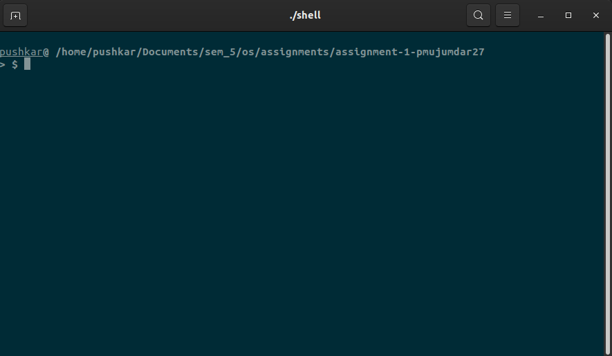

# Custom Shell
This is a custom shell program that can run Unix based commands. Some commands are custom implemented. Others are executed from inbuilt binaries.

## Features -
Custom implemented commands:
- ```ls```
- ```grep```
- ```cat```
- ```mv```
- ```cp``` (with -r flag)
- ```cd```
- ```pwd```
- ```rm``` (with -r flag)
- ```chmod```
- ```mkdir```

Runs inbuilt binaries of other commands.   
Can run programs in the background using ```&``` at the end

## Usage - 
```shell
$ make build
$ ./shell
```

## Screenshots - 

##### Note - Solarized Dark theme was used in the above picture

## Language Used - 
The shell and all the custom commands are written in C.